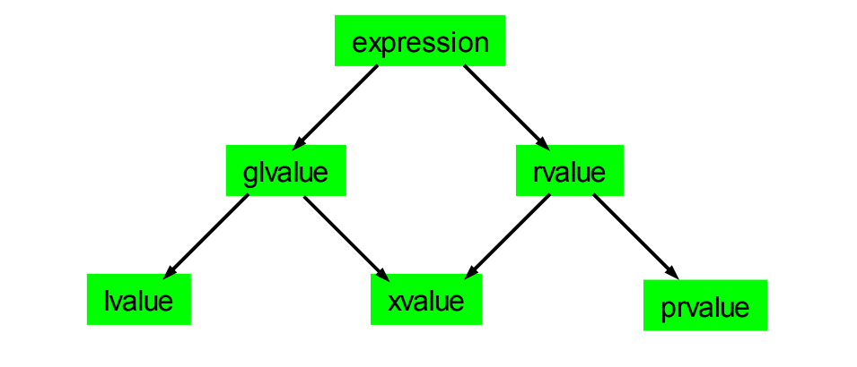

# 特性总览

* [移动语义](#%E7%A7%BB%E5%8A%A8%E8%AF%AD%E4%B9%89)
* [右值引用](#%E5%8F%B3%E5%80%BC%E5%BC%95%E7%94%A8)
* [左值右值](#%E5%B7%A6%E5%80%BC%E5%8F%B3%E5%80%BC)
* [通用引用](#%E9%80%9A%E7%94%A8%E5%BC%95%E7%94%A8)
* [可变参数模板](#%E5%8F%AF%E5%8F%98%E5%8F%82%E6%95%B0%E6%A8%A1%E6%9D%BF)
* [初始化列表](#%E5%88%9D%E5%A7%8B%E5%8C%96%E5%88%97%E8%A1%A8)
* [静态断言](#%E9%9D%99%E6%80%81%E6%96%AD%E8%A8%80)
* [auto](#auto)
* [尾置返回类型](#%E5%B0%BE%E7%BD%AE%E8%BF%94%E5%9B%9E%E7%B1%BB%E5%9E%8B)
* [Lambda](#Lambda)
* [decltype](#decltype)
* [类型别名](#%E7%B1%BB%E5%9E%8B%E5%88%AB%E5%90%8D)
* [nullptr](#nullptr)
* [强类型枚举](#%E5%BC%BA%E7%B1%BB%E5%9E%8B%E6%9E%9A%E4%B8%BE)
* [Attributes](#Attributes)
* [constexpr](#constexpr)
* [委托构造函数](#%E5%A7%94%E6%89%98%E6%9E%84%E9%80%A0%E5%87%BD%E6%95%B0)
* [用户定义字面量](#%E7%94%A8%E6%88%B7%E5%AE%9A%E4%B9%89%E5%AD%97%E9%9D%A2%E9%87%8F)
* [override](#override)
* [final](#final)
* [default](#default)
* [delete](#delete)
* [范围for循环](#%E8%8C%83%E5%9B%B4for%E5%BE%AA%E7%8E%AF)
* [移动特殊成员函数](#%E7%A7%BB%E5%8A%A8%E7%89%B9%E6%AE%8A%E6%88%90%E5%91%98%E5%87%BD%E6%95%B0)
* [转化构造函数](#%E8%BD%AC%E5%8C%96%E6%9E%84%E9%80%A0%E5%87%BD%E6%95%B0)
* [显式类型转换](#%E6%98%BE%E5%BC%8F%E7%B1%BB%E5%9E%8B%E8%BD%AC%E6%8D%A2)
* [内联命名空间](#%E5%86%85%E8%81%94%E5%91%BD%E5%90%8D%E7%A9%BA%E9%97%B4)
* [非静态成员初始化](#%E9%9D%9E%E9%9D%99%E6%80%81%E6%88%90%E5%91%98%E5%88%9D%E5%A7%8B%E5%8C%96)
* [模板右尖括号](#%E6%A8%A1%E6%9D%BF%E5%8F%B3%E5%B0%96%E6%8B%AC%E5%8F%B7)
* [成员函数引用限定符](#%E6%88%90%E5%91%98%E5%87%BD%E6%95%B0%E5%BC%95%E7%94%A8%E9%99%90%E5%AE%9A%E7%AC%A6)
* [noexcept](#noexcept)
* [char32_t和char16_t](#char32_t%E5%92%8Cchar16_t)
* [裸字符串字面量](#%E8%A3%B8%E5%AD%97%E7%AC%A6%E4%B8%B2%E5%AD%97%E9%9D%A2%E9%87%8F)

**C++11标准库新增：**

* [std::move](#stdmove)
* [std::forward](#stdforward)
* [std::thread](#stdthread)
* [std::to_string](#stdto_string)
* [type traits](#type-traits)
* [智能指针](#%E6%99%BA%E8%83%BD%E6%8C%87%E9%92%88)
* [std::chrono](#stdchrono)
* [std::tuple](#stdtuple)
* [std::tie](#stdtie)
* [std::array](#stdarray)
* [无序容器](#%E6%97%A0%E5%BA%8F%E5%AE%B9%E5%99%A8)
* [std::make_shared](stdmake_shared)
* [std::ref](#stdref)
* [memory model](#memory-model)
* [std::async](#stdasync)
* [std::begin/end](#stdbeginend)

## 移动语义

C++11中的移动，意味着将一个对象的某些资源所有权转移给另一个对象。

移动的第一个好处是可能优化性能（不绝对）。当一个对象将要结束它的生命周期时（必须为右值），如果想要获得这个对象上所持有的某些资源，那么移动可能是一种代价更小的方案。比如移动一个 `std::vector`，你只需要将 `std::vector`内部指向数组的指针接收过来即可，如果使用拷贝你需要对 `std::vector`内部数组中的每一个元素都进行拷贝，对一个将要结束生命周期的 `std::vector`来说，拷贝它的代价就是没必要的。

## 右值引用

右值引用，形如 `T&&`，其中T不能是模板参数或者auto（涉及类型推导会变成通用引用）。右值引用只能绑定到右值之上。

## 左值右值


C++11之后，一个表达式可以被拆分成5种值的类型：

+ lvalue：左值，出现在赋值语句左侧的值。左值代表了具有较长生命周期的一个对象或者一个函数。
+ xvalue：xvalue代表了一个将要到达生命周期尽头的对象，因此该对象的资源具有移动的可能。可以看到xvalue既可能是glvalue也可能是rvalue。
+ glvalue：广义左值，既可能是左值，也可能是xvalue。
+ prvalue：纯粹右值，是非xvalue的右值。比如各种类型的字面量都为prvalue。
+ rvalue：右值，出现在赋值语句右侧的值，既可能是xvalue也可能是prvalue。临时对象或者一个与对象无关联的值，都可能是rvalue。

## 通用引用

也叫作转发引用（Forwarding references）。其形如 `T &&`，其中T是模板参数或者auto（涉及到类型推导）。通用引用既可以绑定到左值之上，也可以绑定到右值之上。
假设有这么一个函数 `void foo(T &&)`，当你传递参数类型为左值 `int&`时，那么T被推导为 `int&`，参数实例化为 `void foo(int& &&)`。如果传递参数类型为右值 `int&&`，此时T被推导为 `int`，参数实例化为 `void foo(int &&)`。这就是通用引用能绑定到左值，也能绑定到右值的原因。

这里不熟悉引用折叠的人可能会对 `int& &&`形式感到奇怪，虽然C++不允许使用引用的引用，但是编译器在处理的过程中，是可能会产生引用的引用类型的。
此时会使用一个叫作引用折叠的规则，将引用的引用变换成普通的引用，规则如下：

+ `T& & = T&`
+ `T& && = T&`
+ `T&& & = T&`
+ `T&& && = T&&`

## 可变参数模板

通过在模板参数中使用 `...`语法可以指定参数类型为一个参数包。一个参数包可以接受0个至任意多个模板参数。至少拥有一个参数包的模板称为可变参数模板。

```cpp
template <typename ...Args>
struct Variadic {
  constexpr static int value = sizeof...(T); // sizeof...运算符可以计算参数包中的参数个数
};

static_assert(Variadic<>::value == 0);
static_assert(Variadic<int, double>::value == 2);
```

## 初始化列表

你可以使用语法 `{1, 2, 3}`创建一个包含三个整型元素的列表，拥有类型 `std::initializer_list<int>`。你可以使用这种初始化列表去初始化诸如STL容器、对象等。

注意这个初始化列表搭配大括号初始化会有许多意想不到的行为。
当对象不存在接收参数类型 `std::initializer_list`的构造函数时，你依然可以使用大括号初始化，然后它会去调用构造函数去初始化对象。
若是对象拥有 `std::initializer_list`的构造函数，那么对其使用大括号初始化将会强制使用该构造函数，因为重载决议会认为这个构造函数更加匹配！（可能造成非期望的行为）
边界情况：你的大括号是空的，空的大括号初始化会被认为是默认构造。

还有auto类型推导会将大括号推导为 `std::initializer_list`，而模板推导则不会。

```cpp
auto x = {1, 2, 3}; // x的类型为std::initializer_list 

template <typename T> // 必须要如此声明，模板才能识别初始化列表
void process(T);

process({1, 2, 3}); // Error 

template <typename T>
void process(std::initializer_list<T>);

process({1, 2, 3}) // OK
```

## 静态断言

静态断言可以在编译期完成计算。

```cpp
constexpr int x = 0;
constexpr int y = 0;
static_assert(x == y, "ERROR! X != Y");
```

## auto

使用auto作为对象的类型说明符，可以让编译器来推断类型。
auto除了会将 `{}`推导为初始化列表之外，其余行为与模板类型推导规则相同。

```cpp
template <typename T>
void f(ParamType param);

f(expr);
```

有三种情况：

+ `ParamType`为指针或引用类型（非通用引用）
  + 若 `expr`为引用类型，去掉引用部分。
  + 对 `expr`的余下部分与 `ParamType`进行模式匹配，得到T的类型。
+ `ParamType`为通用引用。
  + `expr`为左值时，T被推导为左值引用。
  + `expr`为右值时，使用第一条的规则。
+ `ParamType`既不是指针也不是引用。
  + 忽略 `expr`的引用部分、`const`部分、`volatile`部分，余下的部分为T的类型。

auto的另一个作用是用作函数返回类型的说明符，这里用到了尾置返回类型语法。

```cpp
auto add(int x, int y) -> decltype(res) {
  int res = x + y;
  return res;
}
```

## 尾置返回类型

C++11开始支持尾置返回类型。使用场景是复杂的返回类型或者依赖于函数参数的返回类型，还可以搭配 `decltype`使用，根据函数体内的表达式推导返回类型。

```cpp
auto function_name(parameters) -> return_type {}
```

## Lambda

Lambda表达式的本质是匿名的重载了函数调用运算符的对象，或者叫作闭包。闭包可以捕获数据，闭包内部会持有被捕获数据的引用或者副本。

Lambda有几种捕获模式：

+ `[]`不捕获任何东西。
+ `[=]`以值传递的方式捕获。默认按值捕获的变量，在闭包的内部为 `const`的。想要修改变量，需要设置闭包为 `mutable`。
+ `[&]`以引用方式捕获。
+ `[this]`捕获 `this`的引用。
+ `[a, &b]`以值传递方式捕获a，以引用方式捕获b。

```cpp
int x = 1;

auto getX = [=]{ return x; } // 不需要参数时，可以不声明参数列表
auto addX = [=](int y){return x + y;}
auto getXRef = [&]() -> int& { return x; }
auto modifyX = [=]() mutable { x = 2; } // OK
```

## decltype

`decltype`是一个运算符，可以返回一个表达式的声明类型。

```cpp
int a;
int &b;
const int &c;
decltype(a); // int
decltype(b); // int&
decltype(c); // const int&
```

## 类型别名

类似 `typedef`，但是比 `typedef`有更好的可读性，并且可以与模板兼容。

```cpp
// using your_name = type_name;
using String = std::string;
```

## nullptr

现在可以用 `nullptr`来代表空指针，其类型为 `nullptr_t`，这种类型可以隐式转换为任何指针类型。
这个特性主要是为了修复以前用NULL代表空指针的设计失败。NULL是一个宏，实际上就是0。使用一个整型常量0代表空指针，可能会在各种隐式类型转换下出现错误。使用 `nullptr`可以保证绝对不会发生偷偷将空指针类型转换成整型，或者将整型转换成指针类型的错误。

```cpp
void foo(int);
void foo(char*);

foo(NULL); //二义性错误
foo(nullptr); // 调用foo(char*)
```

## 强类型枚举

传统C风格枚举的问题有：意想不到的隐式转换，无法指定基础类型，命名空间污染。

```cpp
enum class Color : int { Red = 0xff0000, Green = 0xff00, Blue = 0xff };

Color red = Color::Red;
```

使用 `enum class`，不会出现隐式转换，基础类型可以制定且枚举值也可以指定，名字被限制在枚举域内。

## Attributes

Attributes可以给编译器提供一些辅助信息，语法形式如 `[[attribute-name]]`。

```cpp
// 让编译期不应该忽略该函数的返回值。
[[nodiscard]] auto func() -> int {
  return 1;
}
```

## constexpr

`constexpr`用来指出某个表达式（函数）是可以在编译期就被计算出来的。这个特性让它们可以替换掉字面量，比如模板和数组长度等需要编译期确定的长度，在以往通常都是用字面量，现在可以用 `constexpr`来代替了。

```cpp
constexpr auto square(int x) -> int {
  return x * x;
}

auto square2(int x) -> int {
  return x * x;
}

int a[square(2)];  // OK
int b[square2(2)]; // ERROR
```

## 委托构造函数

现在可以在构造函数的初始化列表中调用同一个类内的其他构造函数。

```cpp
class Foo {
  int foo_;
  Foo(int foo) : foo{foo} {}
  Foo() : Foo(0) {} // 委托构造函数
};
```

## 用户定义字面量

用户定义字面量可以让你加入自己的语法。其语法形式如：`T operator "" X(...) {...}`，函数返回类型为T，函数名为X。这个X的名字需要以_开头，不以_开头的话这个函数会被保留但是永远不会被调用。

```cpp
long long operator "" _celsius(unsigned long long c) {
  return std::llround(c * 1.8 + 32);
}

24_celsius; // == 75

int operator "" _int(const char *str, std::size_t) {
  return std::stoi(str);
}

"123"_int; // == 123
```

## override

在虚函数末尾添加 `override`关键字，如果该函数没有成功重写基类的虚函数，那么编译器会抛出错误，防止你将重载和重写混淆。

```cpp
class A {
public:
  virtual void foo();
  void bar();
};

class B : public A {
public:
  void foo() override; // OK
  void bar() override; // ERROR
};
```

## final

在虚函数末尾添加 `finnal`关键字，可以禁止所有派生类重写它。
在类声明的末尾加 `finnal`关键字，可以禁止继承该类。

```cpp
class A {
public:
  virtual void foo();
};

class B : public A {
public:
  virtual void foo() final;
};

class C : public B {
public:
  virtual void foo(); // ERROR
};
```

## default

在过去，编译器会在必要的时候合成一个类的默认构造函数。现在，你可以用 `default`关键字显式让编译期合成一个默认构造函数。

```cpp
class A {
public:
  A() = default;
};
```

## delete

在过去想要让一个类不能被拷贝，通常是声明其拷贝构造函数为private的。这样的做法有点别扭，现在你可以用 `delete`关键字显式要求某个函数不能被调用。

```cpp
class A {
public:
  A& operator=(const A&) = delete;
};
```

## 范围for循环

for循环的语法糖。

```cpp
std::array<int, 5> a{1, 2, 3, 4, 5};

// 不影响a
for (int x : a) {
  x *= 2;
}

// 影响a
for (int &x : a) {
  x *= 2;
}
```

## 移动特殊成员函数

由于移动语义，现在有了移动构造函数与移动赋值运算符。

```cpp
class A {
  A(A &&rhs);
  A& operator=(A &&rhs);
};
```

## 转化构造函数

转换构造函数可以将大括号语法转换为构造函数的参数。

```cpp
class A {
public:
  A(int) {}
  A(int, int) {}
  A(int, int, int) {}
};

A a {0, 0}; // calls A::A(int, int)
A b(0, 0); // calls A::A(int, int)
A c = {0, 0}; // calls A::A(int, int)
A d {0, 0, 0}; // calls A::A(int, int, int)
```

## 显式类型转换

现在可以通过 `explicit`关键字，要求某个类型转换函数必须被显式调用。

```cpp
class A {
public:
  explicit operator bool() const { return true; }
};

A a;
if (a); // OK
bool b = a; // ERROR
```

## 内联命名空间

内联命名空间中的所有成员视为父命名空间中的一部分。并且这是一个可传递的属性，比如A包含B，B包含C，那么C也是A的一部分。

```cpp
namespace A {
  namespace B {
    void foo();
    void bar();
  }
  inline namespace C {
    void foo();
  }
}

A::B::foo(); // OK
A::foo();    // OK, call A::C::foo()
A::bar();    // ERROR
```

## 非静态成员初始化

允许非静态数据成员在声明时顺便指定初始化，可能会清除默认初始化的构造函数。

```cpp
class Human {
private:
  int age{0};
};
```

## 模板右尖括号

现在连续使用模板时连续的两个右尖括号不会被识别为 `operator >>`了。

```cpp
std::map<int, std::map <int, std::map <int, int> > > cpp98;
std::map<int, std::map <int, std::map <int, int>>>   cpp11;
```

## 成员函数引用限定符

添加了引用限定符的成员函数可以根据 `*this`属于左值还是右值，来决定是否调用。

```cpp
class Bar{};

class Foo {
public:
  Foo getFoo() & { return bar; }
  Foo getFoo() const& { return bar; }
  Foo getFoo() && { return std::move(bar); }
  
private:
  Bar bar;
};
```

## noexcept

noexcept用来指定一个函数不会抛异常，这样编程器可以对其做更加激进的优化。

事实上一个标记为noexcept的函数，编译器不能保证发生异常时，函数栈帧可以展开到该函数。如果标记为noexcept的函数直接或者间接地抛出了异常，并且这个异常没有被捕获，那么默认程序会调用 `std::unexpected()`，该函数的默认行为是调用 `std::terminate()`终止进程。

```cpp
void func() noexcept;
```

## char32_t和char16_t

提供了表示UTF-8字符串的标准类型。

```cpp
char32_t utf8_str[] = U"\u0123";
char16_t utf8_str[] = u"\u0123";
```

## 裸字符串字面量

C++11引入的一种新的表示字符串字面量的方式。可以让我们用键盘直接输入转义字符。

```cpp
const char *msg1 = "\nHello, \n\tworld!\n";
const char *msg2 = R"(
Hello,
	world!
)"; // msg2 == msg1
```

# C++11标准库新增

## std::move

`std::move`可以将参数强制转换为右值。

## std::forward

`std::forward`是视条件决定转换，如果传入的参数是右值，那么将其转换为右值。（C++中用参数接收右值时，该参数本身依然是左值）

## std::thread

`std::thread`提供一种标准的方式控制线程。

## std::to_string

将数字参数转换为 `std::string`。

## type traits

type traits是一系列模板，可以帮助你在编译期检查参数的类型。

```cpp
static_assert(std::is_integral<int>::value);
static_assert(std::is_same<int, int>::value);
static_assert(std::is_same<std::conditional<true, int, double>::type, int>::value);
```

## 智能指针

+ `std::unique_ptr`，不可拷贝，可移动，代表着对资源有独占所有权的指针。该指针析构时会调用对象的析构器。
+ `std::shared_ptr`，可拷贝，可移动，代表着对资源有共享所有权的指针。指向同一个对象的 `std::shared_ptr`共享同一个控制块，控制块上具有引用计数，创建 `std::shared_ptr`会增加，析构则会减少。当引用计数减少为0时，会调用对象的析构器回收内存资源。`std::shared_ptr`对控制块的操作是线程安全的，但是通过 `std::shared_ptr`操作对象本身不是线程安全的。
+ `std::weak_ptr`，不占用对象的引用计数，且可以检测对象是否还存在。可以用来防止 `std::shared_ptr`的循环引用以及可能悬空的 `std::shared_ptr`。

## std::chrono

有关时间、时钟、时间点的库。

```cpp
std::chrono::time_point<std::chrono::steady_clock> start, end;
start = std::chrono::steady_clock::now();
// Some computations...
end = std::chrono::steady_clock::now();

std::chrono::duration<double> elapsed_seconds = end - start;
double t = elapsed_seconds.count(); // t number of seconds, represented as a `double`
```

## tuples

tuples是一个定长的异构集合。可以通过 `std::tie`或者 `std::get`来获取tuples中的元素。

```cpp
// `playerProfile` has type `std::tuple<int, const char*, const char*>`.
auto playerProfile = std::make_tuple(51, "Frans Nielsen", "NYI");
std::get<0>(playerProfile); // 51
std::get<1>(playerProfile); // "Frans Nielsen"
std::get<2>(playerProfile); // "NYI"
```

## std::tie

用于创建一系列左值引用，经常用于解包 `std::pair`和 `std::tuple`，还可以使用 `std::ignore`来作为占用符，忽略tuples中的部分元素。

```cpp
// With tuples...
std::string playerName;
std::tie(std::ignore, playerName, std::ignore) = std::make_tuple(91, "John Tavares", "NYI");

// With pairs...
std::string yes, no;
std::tie(yes, no) = std::make_pair("yes", "no");
```

## std::array

用来代替C风格的数组。

```cpp
std::array<int, 3> a = {1, 2, 3};
```

## 无序容器

+ unordered_set
+ unordered_multiset
+ unordered_map
+ unordered_multimap
  上述容器的搜索、插入、删除都是常数级别时间复杂度（基于哈希）。

## std::make_shared

可以用来创建一个 `std::shared_ptr`。其有如下优势：

+ 可以避开使用 `new`操作符。
+ 指定指针保存的基础类型时，避免代码重复。
+ 异常安全。

## std::ref

`std::ref(val)`创建一个类型为 `std::reference_wrapper`的对象，该对象内部持有对 `val`的引用。当你需要使用的接口的参数类型并非是&时，`std::ref`提供了一种可以以值传递携带引用的方式。`std::cref`类似，不过对象内部持有的是 `const`引用。

## memory model

C++11引入了内存模型，这意味着标准库支持线程和原子操作。这些操作包括但不限于原子加载/存储，比较和交换，原子标志，promises，futures，锁和条件变量。

## std::async

`std::async`可以以异步或者懒惰的方式执行你给定的函数，然后返回 `std::future`，该对象内部持有函数调用的返回值。

构造 `std::async`的第一个参数是一个policy：

+ `std::launch::async | std::launch::deferred`，由系统实现决定是异步运行还是懒惰加载。
+ `std::launch::async`，必须以异步方式执行。（会强制开启一条线程执行）
+ `std::launch::deferred`，必须以懒惰加载的方式执行。

## std::begin/end

可以用来返回容器的起始或者末尾的迭代器，同样适用于普通数组。

```cpp
std::vector<int> vec = {2, 2, 43, 435, 4543, 534};
int arr[8] = {2, 43, 45, 435, 32, 32, 32, 32};
auto a = begin(arr)   // *a = 2
auto b = begin(vec);  // *b = 2
```
